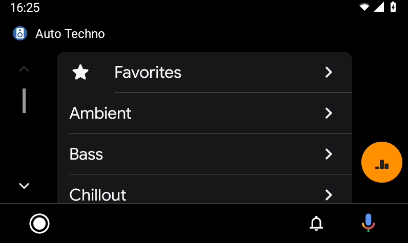

# Auto Techno
Due to the limited amount of media apps which are available for Android Auto, I have decided to create one tailored to my music tastes.
Auto Techno is an Android Auto music app for tuning in to DI.FM Premium radio channels.

The app was a nice opportunity to experiment with Google's media playing library, Exo Player 2.
For more information:
 * https://developer.android.com/guide/topics/media/exoplayer.html
 * https://google.github.io/ExoPlayer/guide.html

## Usage

**NOTE: DI.FM Premium Required**.

* Download Favorites in PLS from DI.FM.
* Update `ChannelHelper.kt` with the channel ids from the PLS.
* Make sure Android *and Android Auto* is set to allow apps from unknown sources. Use some internet search tool for instructions.
* Deploy to Android Device.
    * If you're having problems, try to disable "Instant Run".
    * Running the default "Activity" will prompt you to open Android Auto. It should not crash.
* Start the mobile app and enter your Premium listener key.
* Startup Android Auto and open the app.

Screenshots
======

